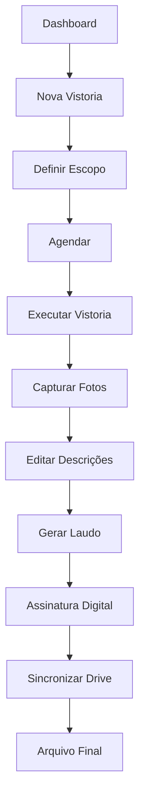
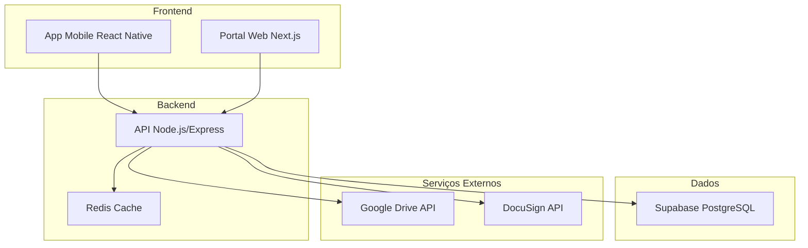
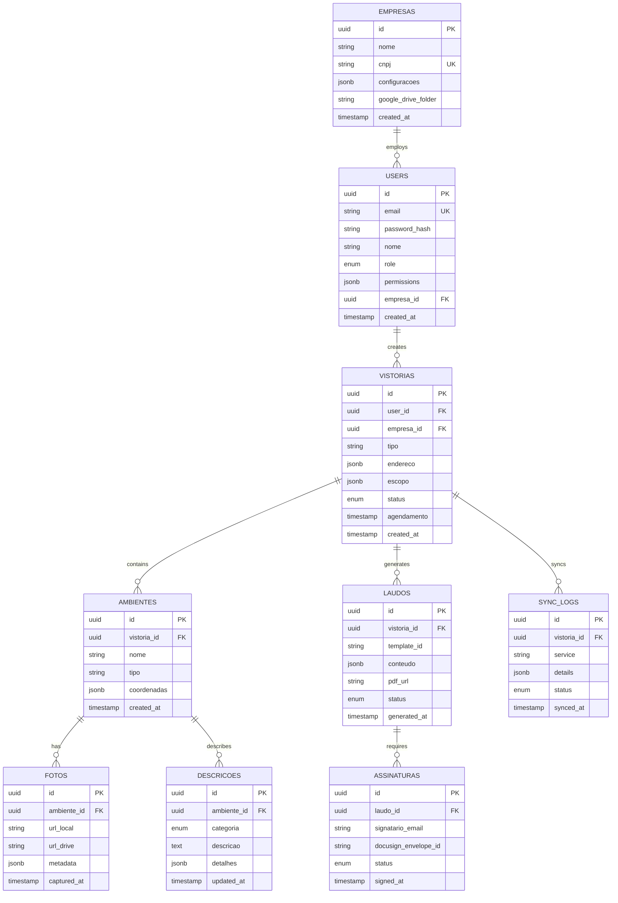

# Sistema Grifo - Especificação Técnica para Produção Completa

## 1. Visão Geral do Produto

O Sistema Grifo é uma plataforma completa de vistorias imobiliárias que oferece autonomia total para criação e gestão de vistorias, com recursos avançados de assinatura digital, descrições detalhadas de ambientes e modelos de laudo diversificados. O sistema integra aplicativo móvel, portal web e API robusta com sincronização em nuvem via Google Drive.

## 2. Funcionalidades Principais

### 2.1 Papéis de Usuário

| Papel         | Método de Registro          | Permissões Principais                                    |
| ------------- | --------------------------- | -------------------------------------------------------- |
| Administrador | Convite do sistema          | Gestão completa, configurações globais, relatórios       |
| Inspetor      | Cadastro aprovado por admin | Criar vistorias, capturar fotos, gerar laudos            |
| Empresa       | Registro com validação      | Solicitar vistorias, visualizar laudos, gestão de equipe |
| Cliente       | Link de acesso              | Visualizar laudo específico, contestar resultados        |

### 2.2 Módulos Funcionais

O sistema de produção consiste nas seguintes páginas principais:

1. **Dashboard Principal**: métricas em tempo real, vistorias pendentes, agenda integrada
2. **Gestão de Vistorias**: criação autônoma, agendamento, workflow completo
3. **Captura de Ambientes**: fotos em lote, descrições editáveis por categoria
4. **Geração de Laudos**: templates diversificados, assinatura digital integrada
5. **Sincronização**: backup automático Google Drive, versionamento
6. **Administração**: usuários, permissões, configurações empresariais

### 2.3 Detalhes das Páginas

| Página        | Módulo               | Descrição da Funcionalidade                                                                       |
| ------------- | -------------------- | ------------------------------------------------------------------------------------------------- |
| Dashboard     | Métricas             | Exibir estatísticas em tempo real, vistorias por status, agenda do dia                            |
| Dashboard     | Ações Rápidas        | Criar nova vistoria, acessar pendências, sincronizar dados                                        |
| Vistorias     | Criação Autônoma     | Criar vistoria sem solicitação externa, definir tipo e escopo                                     |
| Vistorias     | Agendamento          | Calendário integrado, notificações automáticas, reagendamento                                     |
| Captura       | Fotos em Lote        | Capturar múltiplas fotos por ambiente, organização automática                                     |
| Captura       | Descrições Editáveis | Editar descrições de teto, piso, paredes, esquadrias, iluminação, mobiliário, planejados, eletros |
| Laudos        | Templates            | Selecionar modelo por tipo de imóvel, personalização por empresa                                  |
| Laudos        | Assinatura Digital   | Integração DocuSign/Adobe Sign, certificação digital                                              |
| Sincronização | Google Drive         | Backup automático, sincronização offline/online                                                   |
| Administração | Usuários             | Gestão de permissões, níveis de acesso, aprovações                                                |

## 3. Fluxos Principais

### 3.1 Fluxo de Vistoria Autônoma

1. Inspetor acessa dashboard
2. Clica em "Nova Vistoria"
3. Define tipo, endereço e escopo
4. Sistema gera agenda automática
5. Executa vistoria com captura de fotos
6. Edita descrições por ambiente
7. Gera laudo com template apropriado
8. Solicita assinatura digital
9. Sincroniza com Google Drive

### 3.2 Fluxo de Assinatura Digital

1. Laudo finalizado é enviado para assinatura
2. Sistema integra com DocuSign/Adobe Sign
3. Notificação automática para signatários
4. Rastreamento de status de assinatura
5. Certificação digital aplicada
6. Documento final arquivado



## 4. Design da Interface

### 4.1 Estilo de Design

* **Cores Primárias**: #2563EB (azul principal), #1E40AF (azul escuro)

* **Cores Secundárias**: #F3F4F6 (cinza claro), #374151 (cinza escuro)

* **Estilo de Botões**: Arredondados com sombra sutil, efeito hover

* **Tipografia**: Inter (títulos), Open Sans (corpo), tamanhos 14px-24px

* **Layout**: Design responsivo, navegação lateral, cards organizados

* **Ícones**: Heroicons para consistência, estilo outline/solid

### 4.2 Visão Geral das Páginas

| Página        | Módulo      | Elementos de UI                                             |
| ------------- | ----------- | ----------------------------------------------------------- |
| Dashboard     | Métricas    | Cards com estatísticas, gráficos interativos, cores #2563EB |
| Vistorias     | Lista       | Tabela responsiva, filtros avançados, status coloridos      |
| Captura       | Fotos       | Grid de imagens, modal de edição, botões flutuantes         |
| Laudos        | Editor      | WYSIWYG editor, preview em tempo real, toolbar customizada  |
| Configurações | Formulários | Inputs organizados, validação visual, botões de ação        |

### 4.3 Responsividade

Design mobile-first com adaptação para desktop, otimização para touch em tablets, breakpoints em 768px e 1024px.

## 5. Arquitetura Técnica

### 5.1 Estrutura Geral



### 5.2 Stack Tecnológica

* **Frontend Mobile**: React Native + Expo + TypeScript

* **Frontend Web**: Next.js 14 + React 18 + TypeScript + Tailwind CSS

* **Backend**: Node.js + Express + TypeScript

* **Banco de Dados**: Supabase (PostgreSQL)

* **Cache**: Redis

* **Armazenamento**: Google Drive API

* **Assinatura**: DocuSign API / Adobe Sign

* **Autenticação**: Supabase Auth + JWT

### 5.3 Definições de Rotas

| Rota            | Propósito                                  |
| --------------- | ------------------------------------------ |
| /dashboard      | Dashboard principal com métricas e ações   |
| /vistorias      | Gestão completa de vistorias               |
| /vistorias/nova | Criação autônoma de vistoria               |
| /captura/:id    | Interface de captura de fotos e descrições |
| /laudos         | Geração e gestão de laudos                 |
| /assinaturas    | Controle de assinaturas digitais           |
| /sincronizacao  | Status e configuração do Google Drive      |
| /admin          | Painel administrativo                      |
| /configuracoes  | Configurações do usuário e empresa         |

## 6. APIs e Integrações

### 6.1 APIs Principais

**Autenticação**

```
POST /api/auth/login
```

Request:

| Parâmetro | Tipo    | Obrigatório | Descrição            |
| --------- | ------- | ----------- | -------------------- |
| email     | string  | true        | Email do usuário     |
| password  | string  | true        | Senha (hash SHA-256) |
| remember  | boolean | false       | Manter logado        |

Response:

| Parâmetro   | Tipo   | Descrição           |
| ----------- | ------ | ------------------- |
| token       | string | JWT token de acesso |
| user        | object | Dados do usuário    |
| permissions | array  | Lista de permissões |

**Vistorias Autônomas**

```
POST /api/vistorias/autonoma
```

Request:

| Parâmetro   | Tipo     | Obrigatório | Descrição                 |
| ----------- | -------- | ----------- | ------------------------- |
| tipo        | string   | true        | Tipo de vistoria          |
| endereco    | object   | true        | Dados do endereço         |
| escopo      | array    | true        | Itens a serem vistoriados |
| agendamento | datetime | false       | Data/hora preferencial    |

**Google Drive Sync**

```
POST /api/sync/drive
```

Request:

| Parâmetro    | Tipo   | Obrigatório | Descrição         |
| ------------ | ------ | ----------- | ----------------- |
| vistoria\_id | uuid   | true        | ID da vistoria    |
| files        | array  | true        | Lista de arquivos |
| folder\_name | string | false       | Nome da pasta     |

**Assinatura Digital**

```
POST /api/assinatura/docusign
```

Request:

| Parâmetro    | Tipo   | Obrigatório | Descrição            |
| ------------ | ------ | ----------- | -------------------- |
| laudo\_id    | uuid   | true        | ID do laudo          |
| signatarios  | array  | true        | Lista de signatários |
| template\_id | string | false       | Template DocuSign    |

### 6.2 Integrações Externas

**Google Drive API**

* Upload automático de fotos e laudos

* Organização por pastas de vistoria

* Versionamento de documentos

* Sincronização offline/online

**DocuSign API**

* Criação de envelopes de assinatura

* Templates personalizados por empresa

* Rastreamento de status

* Certificação digital

## 7. Modelo de Dados

### 7.1 Diagrama Entidade-Relacionamento



### 7.2 Scripts de Criação

**Tabela de Usuários**

```sql
CREATE TABLE users (
    id UUID PRIMARY KEY DEFAULT gen_random_uuid(),
    email VARCHAR(255) UNIQUE NOT NULL,
    password_hash VARCHAR(255) NOT NULL,
    nome VARCHAR(100) NOT NULL,
    role VARCHAR(20) DEFAULT 'inspetor' CHECK (role IN ('admin', 'inspetor', 'empresa', 'cliente')),
    permissions JSONB DEFAULT '{}',
    empresa_id UUID REFERENCES empresas(id),
    created_at TIMESTAMP WITH TIME ZONE DEFAULT NOW(),
    updated_at TIMESTAMP WITH TIME ZONE DEFAULT NOW()
);

CREATE INDEX idx_users_email ON users(email);
CREATE INDEX idx_users_empresa ON users(empresa_id);
```

**Tabela de Empresas**

```sql
CREATE TABLE empresas (
    id UUID PRIMARY KEY DEFAULT gen_random_uuid(),
    nome VARCHAR(200) NOT NULL,
    cnpj VARCHAR(18) UNIQUE NOT NULL,
    configuracoes JSONB DEFAULT '{}',
    google_drive_folder VARCHAR(255),
    docusign_account_id VARCHAR(100),
    created_at TIMESTAMP WITH TIME ZONE DEFAULT NOW()
);

CREATE INDEX idx_empresas_cnpj ON empresas(cnpj);
```

**Tabela de Vistorias**

```sql
CREATE TABLE vistorias (
    id UUID PRIMARY KEY DEFAULT gen_random_uuid(),
    user_id UUID NOT NULL REFERENCES users(id),
    empresa_id UUID NOT NULL REFERENCES empresas(id),
    tipo VARCHAR(50) NOT NULL,
    endereco JSONB NOT NULL,
    escopo JSONB DEFAULT '[]',
    status VARCHAR(20) DEFAULT 'criada' CHECK (status IN ('criada', 'agendada', 'em_andamento', 'concluida', 'cancelada')),
    agendamento TIMESTAMP WITH TIME ZONE,
    created_at TIMESTAMP WITH TIME ZONE DEFAULT NOW(),
    updated_at TIMESTAMP WITH TIME ZONE DEFAULT NOW()
);

CREATE INDEX idx_vistorias_user ON vistorias(user_id);
CREATE INDEX idx_vistorias_status ON vistorias(status);
CREATE INDEX idx_vistorias_agendamento ON vistorias(agendamento);
```

**Tabela de Ambientes**

```sql
CREATE TABLE ambientes (
    id UUID PRIMARY KEY DEFAULT gen_random_uuid(),
    vistoria_id UUID NOT NULL REFERENCES vistorias(id) ON DELETE CASCADE,
    nome VARCHAR(100) NOT NULL,
    tipo VARCHAR(50) NOT NULL,
    coordenadas JSONB,
    created_at TIMESTAMP WITH TIME ZONE DEFAULT NOW()
);

CREATE INDEX idx_ambientes_vistoria ON ambientes(vistoria_id);
```

**Tabela de Descrições**

```sql
CREATE TABLE descricoes (
    id UUID PRIMARY KEY DEFAULT gen_random_uuid(),
    ambiente_id UUID NOT NULL REFERENCES ambientes(id) ON DELETE CASCADE,
    categoria VARCHAR(20) NOT NULL CHECK (categoria IN ('teto', 'piso', 'paredes', 'esquadrias', 'iluminacao', 'mobiliario', 'planejados', 'eletros')),
    descricao TEXT NOT NULL,
    detalhes JSONB DEFAULT '{}',
    updated_at TIMESTAMP WITH TIME ZONE DEFAULT NOW()
);

CREATE INDEX idx_descricoes_ambiente ON descricoes(ambiente_id);
CREATE INDEX idx_descricoes_categoria ON descricoes(categoria);
```

**Dados Iniciais**

```sql
-- Empresa padrão
INSERT INTO empresas (nome, cnpj, configuracoes) VALUES 
('Grifo Vistorias', '12.345.678/0001-90', '{"templates": ["residencial", "comercial", "industrial"]}');

-- Usuário administrador
INSERT INTO users (email, password_hash, nome, role, permissions, empresa_id) VALUES 
('admin@grifo.com', '$2b$10$hash_da_senha', 'Administrador', 'admin', '{"all": true}', 
 (SELECT id FROM empresas WHERE cnpj = '12.345.678/0001-90'));

-- Templates de laudo
INSERT INTO laudo_templates (nome, tipo, conteudo) VALUES 
('Residencial Padrão', 'residencial', '{"sections": ["identificacao", "ambientes", "conclusao"]}'),
('Comercial Completo', 'comercial', '{"sections": ["identificacao", "estrutura", "instalacoes", "conclusao"]}');
```

## 8. Configurações de Produção

### 8.1 Variáveis de Ambiente

**API (.env)**

```env
# Modo de produção
NODE_ENV=production
DEMO_MODE=false

# Banco de dados
SUPABASE_URL=https://seu-projeto.supabase.co
SUPABASE_ANON_KEY=sua_chave_anonima
SUPABASE_SERVICE_KEY=sua_chave_servico

# Autenticação
JWT_SECRET=sua_chave_jwt_super_secreta
JWT_EXPIRES_IN=24h

# Google Drive
GOOGLE_DRIVE_CLIENT_ID=seu_client_id
GOOGLE_DRIVE_CLIENT_SECRET=seu_client_secret
GOOGLE_DRIVE_REDIRECT_URI=https://api.grifo.com/auth/google/callback

# DocuSign
DOCUSIGN_INTEGRATION_KEY=sua_integration_key
DOCUSIGN_USER_ID=seu_user_id
DOCUSIGN_ACCOUNT_ID=seu_account_id
DOCUSIGN_PRIVATE_KEY_PATH=./keys/docusign_private.key

# Redis
REDIS_URL=redis://localhost:6379

# Servidor
PORT=10000
CORS_ORIGIN=https://app.grifo.com
```

**Portal Web (.env.local)**

```env
# Modo de produção
NEXT_PUBLIC_ENV=production
NEXT_PUBLIC_DEMO_MODE=false

# API
NEXT_PUBLIC_API_URL=https://api.grifo.com
NEXT_PUBLIC_GRIFO_API_BASE_URL=https://api.grifo.com/api/v1

# Supabase
NEXT_PUBLIC_SUPABASE_URL=https://seu-projeto.supabase.co
NEXT_PUBLIC_SUPABASE_ANON_KEY=sua_chave_anonima

# Google Drive
NEXT_PUBLIC_GOOGLE_DRIVE_CLIENT_ID=seu_client_id

# DocuSign
NEXT_PUBLIC_DOCUSIGN_CLIENT_ID=seu_client_id
```

**App Mobile (.env)**

```env
# Modo de produção
EXPO_PUBLIC_ENV=production
EXPO_PUBLIC_DEMO_MODE=false

# API
EXPO_PUBLIC_API_URL=https://api.grifo.com
EXPO_PUBLIC_GRIFO_API_BASE_URL=https://api.grifo.com/api/v1

# Supabase
EXPO_PUBLIC_SUPABASE_URL=https://seu-projeto.supabase.co
EXPO_PUBLIC_SUPABASE_ANON_KEY=sua_chave_anonima
```

### 8.2 Configurações de Segurança

**Políticas RLS (Row Level Security)**

```sql
-- Habilitar RLS em todas as tabelas
ALTER TABLE users ENABLE ROW LEVEL SECURITY;
ALTER TABLE vistorias ENABLE ROW LEVEL SECURITY;
ALTER TABLE ambientes ENABLE ROW LEVEL SECURITY;
ALTER TABLE fotos ENABLE ROW LEVEL SECURITY;

-- Política para usuários
CREATE POLICY "Users can view own data" ON users
    FOR SELECT USING (auth.uid() = id OR 
    EXISTS (SELECT 1 FROM users WHERE id = auth.uid() AND role = 'admin'));

-- Política para vistorias
CREATE POLICY "Users can manage own vistorias" ON vistorias
    FOR ALL USING (user_id = auth.uid() OR 
    EXISTS (SELECT 1 FROM users WHERE id = auth.uid() AND role IN ('admin', 'empresa')));
```

## 9. Cronograma de Implementação

### Fase 1: Infraestrutura e Segurança (Semana 1-2)

* [ ] Desativar modo demonstração em todos os componentes

* [ ] Implementar autenticação completa com níveis de acesso

* [ ] Configurar políticas de segurança no Supabase

* [ ] Implementar sistema de permissões granulares

### Fase 2: Integrações Externas (Semana 3-4)

* [ ] Integração completa com Google Drive API

* [ ] Implementação do DocuSign para assinatura digital

* [ ] Sistema de backup automático

* [ ] Configuração de sincronização offline/online

### Fase 3: Autonomia de Vistorias (Semana 5-6)

* [ ] Interface de criação autônoma de vistorias

* [ ] Sistema de agendamento integrado

* [ ] Workflow completo de vistoria

* [ ] Notificações automáticas

### Fase 4: Descrições e Laudos (Semana 7-8)

* [ ] Editor de descrições por categoria de ambiente

* [ ] Templates de laudo diversificados

* [ ] Sistema de geração automática de PDF

* [ ] Customização por empresa

### Fase 5: Testes e Deploy (Semana 9-10)

* [ ] Testes de integração completos

* [ ] Testes de performance e segurança

* [ ] Deploy em ambiente de produção

* [ ] Treinamento e documentação final

## 10. Monitoramento e Manutenção

### 10.1 Métricas de Performance

* Tempo de resposta das APIs

* Taxa de sincronização com Google Drive

* Taxa de sucesso de assinaturas digitais

* Uso de armazenamento e bandwidth

### 10.2 Logs e Auditoria

* Log de todas as ações de usuário

* Rastreamento de mudanças em vistorias

* Auditoria de acessos e permissões

* Backup automático de logs

### 10.3 Alertas e Notificações

* Falhas de sincronização

* Erros de assinatura digital

* Limites de armazenamento

* Tentativas de acesso não autorizado

