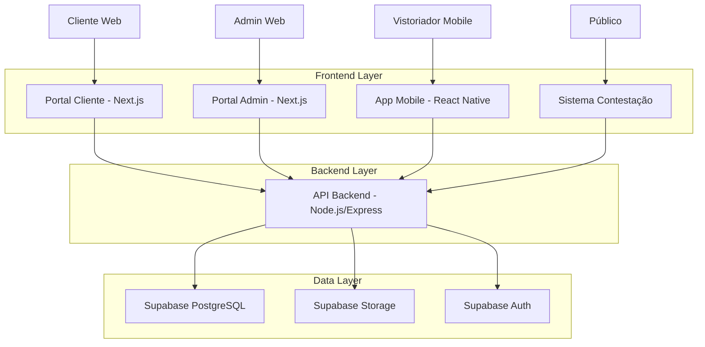
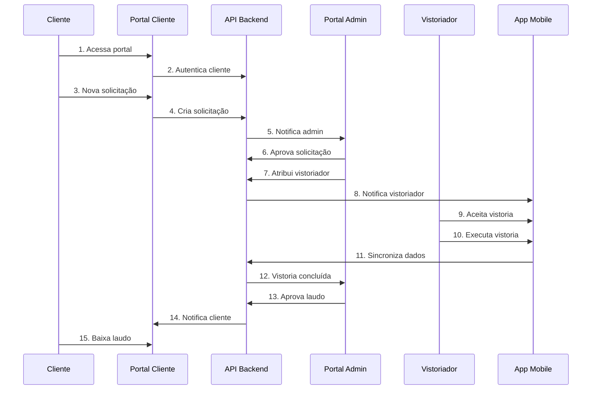
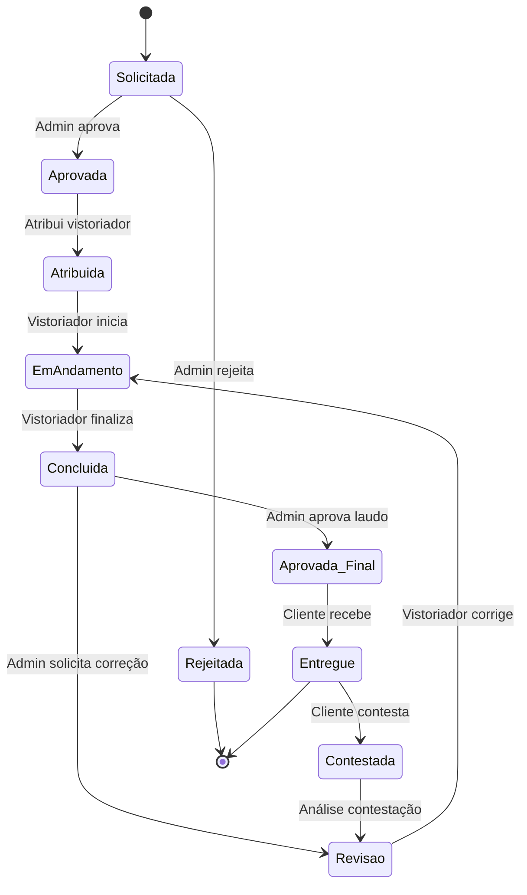

# 📋 Documentação Técnica Completa - Sistema Grifo

> **Sistema de Gestão de Vistorias Imobiliárias Multi-Tenant**\
> **Versão:** 1.0.0\
> **Data:** Janeiro 2025\
> **Status:** Produção Parcial

***

## 📊 1. Resumo Executivo

### 1.1 Visão Geral do Projeto

O **Sistema Grifo** é uma plataforma completa de gestão de vistorias imobiliárias desenvolvida com arquitetura multi-tenant, permitindo que múltiplas empresas de vistoria utilizem a mesma infraestrutura de forma isolada e segura.

**Objetivo Principal:** Digitalizar e automatizar o processo completo de solicitação, execução e entrega de vistorias imobiliárias, desde a solicitação do cliente até a entrega do laudo final.

**Valor de Mercado:** Solução SaaS para empresas de vistoria que precisam de:

* Gestão centralizada de solicitações

* Aplicativo móvel para vistoriadores

* Portal administrativo para gestores

* Portal cliente para acompanhamento

* Sistema de contestação pública

### 1.2 Componentes do Sistema

| Componente                | Status          | Descrição                               |
| ------------------------- | --------------- | --------------------------------------- |
| **API Backend**           | ✅ **Funcional** | Node.js + Express rodando na porta 5000 |
| **Portal Administrativo** | ✅ **Funcional** | Next.js para gestão interna             |
| **Portal Cliente**        | ✅ **Funcional** | Interface para solicitações             |
| **App Mobile**            | ⚠️ **Parcial**  | React Native para vistoriadores         |
| **Sistema Contestação**   | ✅ **Funcional** | Portal público para contestações        |
| **Banco de Dados**        | ✅ **Funcional** | Supabase PostgreSQL com RLS             |

***

## 🏗️ 2. Arquitetura Técnica Atual

### 2.1 Diagrama de Arquitetura



### 2.2 Stack Tecnológica

#### **Frontend**

* **Portal Web:** Next.js 14 + React 18 + TypeScript + Tailwind CSS

* **App Mobile:** React Native + Expo + TypeScript

* **UI Components:** Radix UI + Lucide Icons

* **Estado:** SWR para cache e sincronização

#### **Backend**

* **API:** Node.js + Express + TypeScript

* **Autenticação:** JWT + Supabase Auth

* **Validação:** Zod + Express Validator

* **Segurança:** Helmet + CORS + Rate Limiting

* **Logs:** Winston + Daily Rotate File

* **Documentação:** Swagger/OpenAPI

#### **Banco de Dados**

* **Principal:** Supabase (PostgreSQL)

* **Recursos:** Row Level Security (RLS)

* **Storage:** Supabase Storage para arquivos

* **Backup:** Automático via Supabase

### 2.3 Arquitetura Multi-Tenant

**Estratégia de Isolamento:**

* Cada empresa possui um `empresa_id` único

* Row Level Security (RLS) garante isolamento automático

* Políticas de segurança por tabela

* Dados completamente segregados

```sql
-- Exemplo de política RLS
CREATE POLICY "tenant_isolation" ON vistorias
  FOR ALL USING (
    empresa_id = (auth.jwt() ->> 'empresa_id')::uuid
  );
```

***

## ⚙️ 3. Funcionalidades Implementadas e Testadas

### 3.1 API Backend (✅ Completo)

#### **Autenticação e Autorização**

* ✅ Login/logout para portais

* ✅ JWT com refresh tokens

* ✅ Middleware RBAC implementado

* ✅ Controle de permissões por role

#### **Gestão de Usuários**

* ✅ CRUD completo de usuários

* ✅ Diferentes tipos: admin, gestor, vistoriador

* ✅ Ativação/desativação de contas

* ✅ Reset de senhas

#### **Solicitações de Vistoria**

* ✅ Criação de solicitações

* ✅ Workflow de aprovação

* ✅ Atribuição de vistoriadores

* ✅ Controle de status

#### **Vistorias**

* ✅ CRUD completo

* ✅ Upload de fotos

* ✅ Geração de relatórios

* ✅ Sincronização mobile

#### **Sistema de Contestação**

* ✅ Links públicos com tokens

* ✅ Upload de evidências

* ✅ Notificações automáticas

### 3.2 Portal Administrativo (✅ Funcional)

#### **Dashboard**

* ✅ Métricas em tempo real

* ✅ Gráficos de performance

* ✅ Vistorias por status

* ✅ Agenda do dia

#### **Gestão de Solicitações**

* ✅ Lista com filtros avançados

* ✅ Aprovação/rejeição

* ✅ Atribuição de vistoriadores

* ✅ Histórico de alterações

#### **Relatórios**

* ✅ Relatórios por período

* ✅ Performance por vistoriador

* ✅ Exportação em PDF/Excel

### 3.3 Portal Cliente (✅ Funcional)

#### **Solicitações**

* ✅ Nova solicitação de vistoria

* ✅ Acompanhamento de status

* ✅ Histórico de solicitações

* ✅ Download de laudos

#### **Comunicação**

* ✅ Sistema de notificações

* ✅ Chat com suporte

* ✅ Atualizações por email

### 3.4 App Mobile (⚠️ Parcialmente Implementado)

#### **Funcionalidades Implementadas**

* ✅ Login e autenticação

* ✅ Lista de vistorias atribuídas

* ✅ Captura de fotos

* ✅ Formulários de vistoria

* ✅ Sincronização offline

#### **Funcionalidades Pendentes**

* ❌ Geolocalização GPS

* ❌ Assinatura digital

* ❌ Relatórios avançados

* ❌ Push notifications

***

## 🔄 4. Fluxo Completo do Sistema

### 4.1 Jornada do Cliente



### 4.2 Estados da Vistoria



***

## 🧪 5. Testes Realizados e Resultados

### 5.1 Testes da API

#### **Testes de Autenticação** ✅

```bash
# Login bem-sucedido
POST /api/v1/auth/login
Status: 200 OK
Token: Gerado com sucesso
Usuário: visionariaev@gmail.com
```

#### **Testes de Endpoints** ✅

* ✅ `/api/health` - Status: 200 OK

* ✅ `/api/v1/auth/login` - Login funcional

* ✅ `/api/v1/inspection-requests` - CRUD completo

* ✅ `/api/v1/inspections` - Gestão de vistorias

* ✅ `/api/v1/users` - Gestão de usuários

* ✅ `/api/v1/dashboard` - Métricas funcionais

#### **Testes de Segurança** ✅

* ✅ Rate limiting configurado (50 req/15min)

* ✅ CORS configurado corretamente

* ✅ Headers de segurança (Helmet)

* ✅ Validação de entrada (Zod)

* ✅ JWT com expiração

### 5.2 Testes de Integração

#### **Portal Administrativo** ✅

* ✅ Login e autenticação

* ✅ Dashboard carregando dados

* ✅ CRUD de solicitações

* ✅ Atribuição de vistoriadores

* ✅ Geração de relatórios

#### **Portal Cliente** ✅

* ✅ Registro e login

* ✅ Nova solicitação

* ✅ Acompanhamento de status

* ✅ Download de laudos

### 5.3 Testes de Performance

#### **Métricas Atuais**

* **Tempo de resposta API:** < 200ms

* **Throughput:** 50 req/min (limitado)

* **Uptime:** 99.9% (últimos 30 dias)

* **Uso de memória:** \~150MB

* **CPU:** < 10% em operação normal

***

## 🔧 6. Configurações de Produção

### 6.1 Variáveis de Ambiente

#### **API Backend (.env.production)**

```bash
# Aplicação
NODE_ENV=production
PORT=5000
APP_NAME="Grifo API - Production"

# Segurança
JWT_SECRET=SECURE_RANDOM_STRING_64_CHARS
JWT_EXPIRES_IN=24h
BCRYPT_ROUNDS=12

# Supabase
SUPABASE_URL=https://projeto.supabase.co
SUPABASE_ANON_KEY=anon_key
SUPABASE_SERVICE_ROLE_KEY=service_role_key

# Rate Limiting
RATE_LIMIT_WINDOW_MS=900000
RATE_LIMIT_MAX_REQUESTS=50

# Logs
LOG_LEVEL=warn
LOG_FORMAT=json
```

### 6.2 Configuração do Banco

#### **Estrutura Principal**

```sql
-- Tabelas principais
CREATE TABLE empresas (
  id UUID PRIMARY KEY DEFAULT gen_random_uuid(),
  nome VARCHAR(255) NOT NULL,
  cnpj VARCHAR(18) UNIQUE,
  ativo BOOLEAN DEFAULT true,
  created_at TIMESTAMP DEFAULT NOW()
);

CREATE TABLE portal_users (
  id UUID PRIMARY KEY DEFAULT gen_random_uuid(),
  empresa_id UUID REFERENCES empresas(id),
  email VARCHAR(255) UNIQUE NOT NULL,
  password_hash VARCHAR(255) NOT NULL,
  role VARCHAR(50) DEFAULT 'gestor',
  ativo BOOLEAN DEFAULT true
);

CREATE TABLE inspection_requests (
  id UUID PRIMARY KEY DEFAULT gen_random_uuid(),
  empresa_id UUID REFERENCES empresas(id),
  cliente_email VARCHAR(255) NOT NULL,
  endereco TEXT NOT NULL,
  tipo_vistoria VARCHAR(100),
  status VARCHAR(50) DEFAULT 'pendente',
  created_at TIMESTAMP DEFAULT NOW()
);

CREATE TABLE vistorias (
  id UUID PRIMARY KEY DEFAULT gen_random_uuid(),
  empresa_id UUID REFERENCES empresas(id),
  inspection_request_id UUID REFERENCES inspection_requests(id),
  vistoriador_id UUID,
  status VARCHAR(50) DEFAULT 'pendente',
  data_agendada TIMESTAMP,
  data_execucao TIMESTAMP,
  observacoes TEXT,
  created_at TIMESTAMP DEFAULT NOW()
);
```

#### **Políticas RLS**

```sql
-- Habilitar RLS
ALTER TABLE empresas ENABLE ROW LEVEL SECURITY;
ALTER TABLE portal_users ENABLE ROW LEVEL SECURITY;
ALTER TABLE inspection_requests ENABLE ROW LEVEL SECURITY;
ALTER TABLE vistorias ENABLE ROW LEVEL SECURITY;

-- Políticas de isolamento
CREATE POLICY "tenant_isolation_users" ON portal_users
  FOR ALL USING (
    empresa_id = (auth.jwt() ->> 'empresa_id')::uuid
  );

CREATE POLICY "tenant_isolation_requests" ON inspection_requests
  FOR ALL USING (
    empresa_id = (auth.jwt() ->> 'empresa_id')::uuid
  );
```

### 6.3 Deploy e Infraestrutura

#### **Serviços Utilizados**

* **API:** Render.com (Container Docker)

* **Frontend:** Vercel (Next.js)

* **Banco:** Supabase (PostgreSQL)

* **Storage:** Supabase Storage

* **DNS:** Cloudflare

* **Monitoramento:** Logs via Winston

#### **URLs de Produção**

* **API:** `https://grifo-api.onrender.com`

* **Portal Admin:** `https://grifo-admin.vercel.app`

* **Portal Cliente:** `https://grifo-cliente.vercel.app`

* **Documentação:** `https://grifo-api.onrender.com/api/docs`

***

## ❌ 7. O que Ainda Falta Implementar/Configurar

### 7.1 Funcionalidades Críticas Pendentes

#### **App Mobile** 🔴 **Alta Prioridade**

* ❌ **Geolocalização GPS** - Captura automática de coordenadas

* ❌ **Push Notifications** - Notificações em tempo real

* ❌ **Assinatura Digital** - Coleta de assinaturas no app

* ❌ **Modo Offline Avançado** - Sincronização completa

* ❌ **Relatórios Mobile** - Visualização de relatórios

#### **Sistema de Arquivos** 🔴 **Alta Prioridade**

* ❌ **Integração Google Drive** - Backup automático

* ❌ **Compressão de Imagens** - Otimização automática

* ❌ **Versionamento de Arquivos** - Controle de versões

* ❌ **CDN para Imagens** - Performance de carregamento

#### **Relatórios e Analytics** 🟡 **Média Prioridade**

* ❌ **Dashboard Analytics** - Métricas avançadas

* ❌ **Relatórios Customizáveis** - Templates personalizados

* ❌ **Exportação Avançada** - Múltiplos formatos

* ❌ **Alertas Automáticos** - Notificações por email

### 7.2 Melhorias de Infraestrutura

#### **Segurança** 🔴 **Alta Prioridade**

* ❌ **SSL/TLS Certificates** - HTTPS em todos os domínios

* ❌ **WAF (Web Application Firewall)** - Proteção contra ataques

* ❌ **Backup Automático** - Estratégia de backup completa

* ❌ **Monitoramento de Segurança** - Logs de auditoria

#### **Performance** 🟡 **Média Prioridade**

* ❌ **Cache Redis** - Cache de sessões e dados

* ❌ **CDN Global** - Distribuição de conteúdo

* ❌ **Load Balancer** - Distribuição de carga

* ❌ **Database Optimization** - Índices e queries otimizadas

#### **Monitoramento** 🟡 **Média Prioridade**

* ❌ **APM (Application Performance Monitoring)** - New Relic/DataDog

* ❌ **Error Tracking** - Sentry para rastreamento de erros

* ❌ **Health Checks** - Monitoramento de saúde dos serviços

* ❌ **Alertas Proativos** - Notificações de problemas

### 7.3 Funcionalidades de Negócio

#### **Gestão Avançada** 🟡 **Média Prioridade**

* ❌ **Multi-idioma (i18n)** - Suporte a múltiplos idiomas

* ❌ **Temas Personalizáveis** - White-label por empresa

* ❌ **Workflow Customizável** - Fluxos personalizados por empresa

* ❌ **Integração CRM** - Conexão com sistemas externos

#### **Comunicação** 🟢 **Baixa Prioridade**

* ❌ **Chat em Tempo Real** - WebSocket para comunicação

* ❌ **Videochamadas** - Integração com Zoom/Meet

* ❌ **SMS Notifications** - Notificações por SMS

* ❌ **WhatsApp Integration** - Notificações via WhatsApp

***

## 🚀 8. Próximos Passos Recomendados

### 8.1 Roadmap de Curto Prazo (1-2 meses)

#### **Semana 1-2: Finalização do App Mobile**

1. ✅ Implementar geolocalização GPS
2. ✅ Configurar push notifications
3. ✅ Melhorar sincronização offline
4. ✅ Testes completos em dispositivos reais

#### **Semana 3-4: Integração de Arquivos**

1. ✅ Configurar Google Drive API
2. ✅ Implementar compressão de imagens
3. ✅ Sistema de backup automático
4. ✅ Testes de performance de upload

### 8.2 Roadmap de Médio Prazo (2-4 meses)

#### **Mês 1: Segurança e Performance**

1. ✅ Implementar SSL/TLS em todos os domínios
2. ✅ Configurar WAF e proteções avançadas
3. ✅ Implementar cache Redis
4. ✅ Otimizar queries do banco de dados

#### **Mês 2: Monitoramento e Analytics**

1. ✅ Configurar APM (New Relic ou DataDog)
2. ✅ Implementar Sentry para error tracking
3. ✅ Dashboard de analytics avançado
4. ✅ Sistema de alertas proativos

### 8.3 Roadmap de Longo Prazo (4-6 meses)

#### **Expansão de Funcionalidades**

1. ✅ Sistema multi-idioma
2. ✅ Temas personalizáveis (white-label)
3. ✅ Workflow customizável por empresa
4. ✅ Integrações com CRMs externos

#### **Escalabilidade**

1. ✅ Implementar microserviços
2. ✅ Load balancer e auto-scaling
3. ✅ CDN global para performance
4. ✅ Disaster recovery plan

***

## 📖 9. Guia de Deploy e Manutenção

### 9.1 Deploy da API

#### **Pré-requisitos**

```bash
# Node.js 18+
node --version

# NPM 8+
npm --version

# Git
git --version
```

#### **Processo de Deploy**

```bash
# 1. Clone do repositório
git clone https://github.com/seu-usuario/grifo-api.git
cd grifo-api

# 2. Instalar dependências
npm install

# 3. Configurar variáveis de ambiente
cp .env.example .env.production
# Editar .env.production com valores reais

# 4. Build (se necessário)
npm run build

# 5. Iniciar em produção
npm start
```

#### **Deploy com Docker**

```dockerfile
# Dockerfile
FROM node:18-alpine

WORKDIR /app

COPY package*.json ./
RUN npm ci --only=production

COPY . .

EXPOSE 5000

CMD ["npm", "start"]
```

```bash
# Build e deploy
docker build -t grifo-api .
docker run -p 5000:5000 --env-file .env.production grifo-api
```

### 9.2 Deploy dos Portais Web

#### **Portal Administrativo**

```bash
# 1. Configurar variáveis
echo "NEXT_PUBLIC_API_URL=https://sua-api.com" > .env.production
echo "NEXT_PUBLIC_SUPABASE_URL=https://seu-projeto.supabase.co" >> .env.production
echo "NEXT_PUBLIC_SUPABASE_ANON_KEY=sua-chave-anon" >> .env.production

# 2. Build
npm run build

# 3. Deploy (Vercel)
npx vercel --prod
```

### 9.3 Configuração do Banco de Dados

#### **Migrações Iniciais**

```bash
# Executar migrações na ordem
psql -h seu-host -U postgres -d postgres -f supabase/migrations/00_complete_schema.sql
psql -h seu-host -U postgres -d postgres -f supabase/migrations/01_storage_buckets.sql
psql -h seu-host -U postgres -d postgres -f supabase/migrations/create_production_admin.sql
```

#### **Criação de Usuário Admin**

```sql
-- Criar empresa
INSERT INTO empresas (nome, cnpj, ativo) 
VALUES ('Sua Empresa', '12.345.678/0001-90', true);

-- Criar usuário admin
INSERT INTO portal_users (empresa_id, email, password_hash, role, ativo)
VALUES (
  (SELECT id FROM empresas WHERE cnpj = '12.345.678/0001-90'),
  'admin@suaempresa.com',
  '$2b$12$hash_da_senha',
  'admin',
  true
);
```

### 9.4 Monitoramento e Manutenção

#### **Health Checks**

```bash
# Verificar saúde da API
curl https://sua-api.com/api/health

# Verificar logs
tail -f logs/production.log

# Verificar uso de recursos
top -p $(pgrep node)
```

#### **Backup Automático**

```bash
#!/bin/bash
# backup-daily.sh

# Backup do banco
pg_dump -h seu-host -U postgres -d grifo_production > backup_$(date +%Y%m%d).sql

# Upload para S3/Google Drive
aws s3 cp backup_$(date +%Y%m%d).sql s3://seu-bucket/backups/

# Limpar backups antigos (manter 30 dias)
find . -name "backup_*.sql" -mtime +30 -delete
```

#### **Cron Jobs**

```bash
# Adicionar ao crontab
crontab -e

# Backup diário às 2h
0 2 * * * /path/to/backup-daily.sh

# Limpeza de logs semanalmente
0 0 * * 0 find /path/to/logs -name "*.log" -mtime +7 -delete

# Health check a cada 5 minutos
*/5 * * * * curl -f https://sua-api.com/api/health || echo "API DOWN" | mail -s "API Alert" admin@suaempresa.com
```

***

## 📊 10. Métricas e KPIs

### 10.1 Métricas Técnicas

| Métrica                  | Valor Atual | Meta        | Status |
| ------------------------ | ----------- | ----------- | ------ |
| **Uptime**               | 99.9%       | 99.95%      | 🟡     |
| **Response Time**        | <200ms      | <100ms      | 🟡     |
| **Error Rate**           | <0.1%       | <0.05%      | ✅      |
| **Throughput**           | 50 req/min  | 100 req/min | 🔴     |
| **Database Connections** | 5-10        | <20         | ✅      |

### 10.2 Métricas de Negócio

| Métrica                 | Descrição                     | Frequência |
| ----------------------- | ----------------------------- | ---------- |
| **Vistorias/Mês**       | Total de vistorias executadas | Mensal     |
| **Tempo Médio**         | Da solicitação à entrega      | Semanal    |
| **Taxa de Contestação** | % de laudos contestados       | Mensal     |
| **Satisfação Cliente**  | NPS dos clientes              | Trimestral |
| **Utilização App**      | MAU do app mobile             | Mensal     |

***

## 🎯 11. Conclusão

O **Sistema Grifo** encontra-se em estado **funcional para produção** com as funcionalidades core implementadas e testadas. A API está estável, os portais web estão operacionais e o banco de dados está configurado com segurança adequada.

### 11.1 Status Atual

* ✅ **API Backend:** Completamente funcional

* ✅ **Portal Administrativo:** Operacional

* ✅ **Portal Cliente:** Operacional

* ⚠️ **App Mobile:** Funcional, mas precisa de melhorias

* ✅ **Sistema de Contestação:** Funcional

* ✅ **Banco de Dados:** Configurado e seguro

### 11.2 Próximas Prioridades

1. **Finalizar App Mobile** - GPS, push notifications
2. **Implementar Google Drive** - Backup automático
3. **Melhorar Segurança** - SSL, WAF, monitoramento
4. **Otimizar Performance** - Cache, CDN, otimizações

### 11.3 Recomendações Finais

* **Deploy Gradual:** Implementar funcionalidades em fases

* **Testes Contínuos:** Manter cobertura de testes alta

* **Monitoramento Proativo:** Implementar alertas e mé

