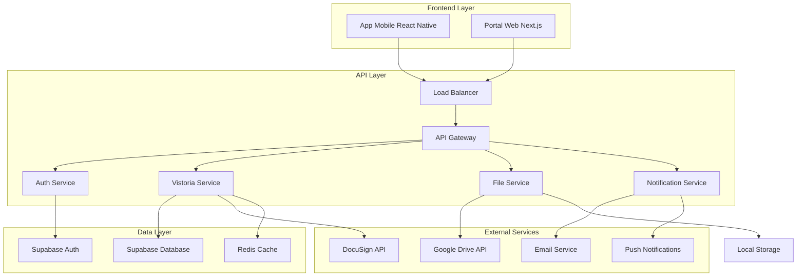
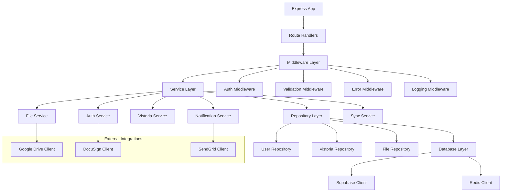

# Arquitetura Técnica - Sistema Grifo Produção

## 1. Arquitetura Geral



## 2. Stack Tecnológica Detalhada

* **Frontend Mobile**: React Native 0.72 + Expo SDK 49 + TypeScript 5.0

* **Frontend Web**: Next.js 14 + React 18 + TypeScript 5.0 + Tailwind CSS 3.3

* **Backend**: Node.js 18 + Express 4.18 + TypeScript 5.0

* **Database**: Supabase (PostgreSQL 15)

* **Cache**: Redis 7.0

* **File Storage**: Google Drive API v3

* **Authentication**: Supabase Auth + JWT

* **Digital Signature**: DocuSign eSignature API

* **Push Notifications**: Expo Notifications

* **Email**: SendGrid API

## 3. Definições de Rotas da API

| Rota                      | Método              | Propósito                     |
| ------------------------- | ------------------- | ----------------------------- |
| /api/auth/login           | POST                | Autenticação de usuário       |
| /api/auth/refresh         | POST                | Renovação de token            |
| /api/auth/logout          | POST                | Logout e invalidação de token |
| /api/users                | GET/POST/PUT        | Gestão de usuários            |
| /api/empresas             | GET/POST/PUT        | Gestão de empresas            |
| /api/vistorias            | GET/POST/PUT/DELETE | CRUD de vistorias             |
| /api/vistorias/autonoma   | POST                | Criação autônoma de vistoria  |
| /api/ambientes            | GET/POST/PUT/DELETE | Gestão de ambientes           |
| /api/fotos/upload         | POST                | Upload de fotos               |
| /api/fotos/batch          | POST                | Upload em lote                |
| /api/descricoes           | GET/POST/PUT        | Descrições de ambientes       |
| /api/laudos/generate      | POST                | Geração de laudo              |
| /api/laudos/templates     | GET                 | Templates de laudo            |
| /api/assinaturas/docusign | POST                | Iniciar processo DocuSign     |
| /api/assinaturas/webhook  | POST                | Webhook DocuSign              |
| /api/sync/drive           | POST                | Sincronização Google Drive    |
| /api/sync/status          | GET                 | Status de sincronização       |

## 4. APIs Detalhadas

### 4.1 Autenticação e Autorização

**Login de Usuário**

```typescript
POST /api/auth/login

interface LoginRequest {
  email: string;
  password: string;
  remember?: boolean;
}

interface LoginResponse {
  success: boolean;
  token: string;
  refreshToken: string;
  user: {
    id: string;
    email: string;
    nome: string;
    role: 'admin' | 'inspetor' | 'empresa' | 'cliente';
    permissions: string[];
    empresa: {
      id: string;
      nome: string;
      configuracoes: object;
    };
  };
}
```

**Middleware de Autenticação**

```typescript
interface AuthenticatedRequest extends Request {
  user: {
    id: string;
    role: string;
    permissions: string[];
    empresaId: string;
  };
}

const authMiddleware = async (req: AuthenticatedRequest, res: Response, next: NextFunction) => {
  const token = req.headers.authorization?.replace('Bearer ', '');
  if (!token) return res.status(401).json({ error: 'Token required' });
  
  try {
    const decoded = jwt.verify(token, process.env.JWT_SECRET!);
    req.user = decoded as any;
    next();
  } catch (error) {
    return res.status(401).json({ error: 'Invalid token' });
  }
};
```

### 4.2 Vistorias Autônomas

**Criação de Vistoria Autônoma**

```typescript
POST /api/vistorias/autonoma

interface VistoriaAutonomaRequest {
  tipo: 'residencial' | 'comercial' | 'industrial';
  endereco: {
    cep: string;
    logradouro: string;
    numero: string;
    complemento?: string;
    bairro: string;
    cidade: string;
    uf: string;
  };
  escopo: string[];
  agendamento?: string; // ISO date
  observacoes?: string;
}

interface VistoriaResponse {
  id: string;
  numero: string;
  status: 'criada' | 'agendada' | 'em_andamento' | 'concluida';
  agendamento?: string;
  qrCode: string; // Para acesso rápido no mobile
}
```

### 4.3 Upload e Gestão de Fotos

**Upload em Lote**

```typescript
POST /api/fotos/batch
Content-Type: multipart/form-data

interface BatchUploadRequest {
  ambienteId: string;
  fotos: File[];
  metadata: {
    categoria: 'geral' | 'detalhe' | 'panoramica';
    coordenadas?: { lat: number; lng: number };
    timestamp: string;
  }[];
}

interface BatchUploadResponse {
  success: boolean;
  fotos: {
    id: string;
    url: string;
    thumbnail: string;
    metadata: object;
  }[];
  syncStatus: 'pending' | 'synced' | 'error';
}
```

### 4.4 Descrições de Ambientes

**Atualização de Descrições**

```typescript
PUT /api/descricoes/:ambienteId

interface DescricoesRequest {
  descricoes: {
    categoria: 'teto' | 'piso' | 'paredes' | 'esquadrias' | 'iluminacao' | 'mobiliario' | 'planejados' | 'eletros';
    descricao: string;
    detalhes: {
      material?: string;
      cor?: string;
      estado?: 'otimo' | 'bom' | 'regular' | 'ruim' | 'pessimo';
      observacoes?: string;
    };
  }[];
}

interface DescricoesResponse {
  success: boolean;
  descricoes: {
    id: string;
    categoria: string;
    descricao: string;
    detalhes: object;
    updatedAt: string;
  }[];
}
```

### 4.5 Geração de Laudos

**Geração de Laudo**

```typescript
POST /api/laudos/generate

interface LaudoRequest {
  vistoriaId: string;
  templateId: string;
  configuracoes: {
    incluirFotos: boolean;
    incluirDescricoes: boolean;
    formato: 'pdf' | 'docx';
    assinatura: {
      requerida: boolean;
      signatarios: string[];
    };
  };
}

interface LaudoResponse {
  id: string;
  url: string;
  status: 'gerado' | 'aguardando_assinatura' | 'assinado';
  assinaturas: {
    signatario: string;
    status: 'pendente' | 'assinado';
    dataAssinatura?: string;
  }[];
}
```

### 4.6 Integração DocuSign

**Iniciar Processo de Assinatura**

```typescript
POST /api/assinaturas/docusign

interface DocuSignRequest {
  laudoId: string;
  signatarios: {
    email: string;
    nome: string;
    ordem: number;
  }[];
  templateId?: string;
  configuracoes: {
    lembretes: boolean;
    prazoAssinatura: number; // dias
  };
}

interface DocuSignResponse {
  envelopeId: string;
  status: 'sent';
  signingUrls: {
    signatario: string;
    url: string;
  }[];
}
```

### 4.7 Sincronização Google Drive

**Sincronização Manual**

```typescript
POST /api/sync/drive

interface SyncRequest {
  vistoriaId: string;
  items: ('fotos' | 'laudos' | 'documentos')[];
  forceSync?: boolean;
}

interface SyncResponse {
  success: boolean;
  syncId: string;
  status: 'started' | 'completed' | 'error';
  details: {
    fotosSync: number;
    laudosSync: number;
    documentosSync: number;
  };
  driveFolder: {
    id: string;
    url: string;
  };
}
```

## 5. Arquitetura do Servidor



## 6. Modelo de Dados Completo

### 6.1 Estrutura de Tabelas

```sql
-- Tabela de empresas
CREATE TABLE empresas (
    id UUID PRIMARY KEY DEFAULT gen_random_uuid(),
    nome VARCHAR(200) NOT NULL,
    cnpj VARCHAR(18) UNIQUE NOT NULL,
    email VARCHAR(255),
    telefone VARCHAR(20),
    endereco JSONB,
    configuracoes JSONB DEFAULT '{}',
    google_drive_config JSONB,
    docusign_config JSONB,
    plano VARCHAR(20) DEFAULT 'basico',
    ativo BOOLEAN DEFAULT true,
    created_at TIMESTAMP WITH TIME ZONE DEFAULT NOW(),
    updated_at TIMESTAMP WITH TIME ZONE DEFAULT NOW()
);

-- Tabela de usuários
CREATE TABLE users (
    id UUID PRIMARY KEY DEFAULT gen_random_uuid(),
    email VARCHAR(255) UNIQUE NOT NULL,
    password_hash VARCHAR(255) NOT NULL,
    nome VARCHAR(100) NOT NULL,
    telefone VARCHAR(20),
    role VARCHAR(20) DEFAULT 'inspetor' CHECK (role IN ('admin', 'inspetor', 'empresa', 'cliente')),
    permissions JSONB DEFAULT '[]',
    empresa_id UUID REFERENCES empresas(id),
    ultimo_login TIMESTAMP WITH TIME ZONE,
    ativo BOOLEAN DEFAULT true,
    created_at TIMESTAMP WITH TIME ZONE DEFAULT NOW(),
    updated_at TIMESTAMP WITH TIME ZONE DEFAULT NOW()
);

-- Tabela de vistorias
CREATE TABLE vistorias (
    id UUID PRIMARY KEY DEFAULT gen_random_uuid(),
    numero VARCHAR(20) UNIQUE NOT NULL,
    user_id UUID NOT NULL REFERENCES users(id),
    empresa_id UUID NOT NULL REFERENCES empresas(id),
    tipo VARCHAR(50) NOT NULL,
    endereco JSONB NOT NULL,
    escopo JSONB DEFAULT '[]',
    status VARCHAR(20) DEFAULT 'criada' CHECK (status IN ('criada', 'agendada', 'em_andamento', 'concluida', 'cancelada')),
    agendamento TIMESTAMP WITH TIME ZONE,
    data_inicio TIMESTAMP WITH TIME ZONE,
    data_conclusao TIMESTAMP WITH TIME ZONE,
    observacoes TEXT,
    qr_code VARCHAR(100) UNIQUE,
    created_at TIMESTAMP WITH TIME ZONE DEFAULT NOW(),
    updated_at TIMESTAMP WITH TIME ZONE DEFAULT NOW()
);

-- Tabela de ambientes
CREATE TABLE ambientes (
    id UUID PRIMARY KEY DEFAULT gen_random_uuid(),
    vistoria_id UUID NOT NULL REFERENCES vistorias(id) ON DELETE CASCADE,
    nome VARCHAR(100) NOT NULL,
    tipo VARCHAR(50) NOT NULL,
    area_m2 DECIMAL(10,2),
    coordenadas JSONB,
    ordem INTEGER DEFAULT 0,
    created_at TIMESTAMP WITH TIME ZONE DEFAULT NOW()
);

-- Tabela de fotos
CREATE TABLE fotos (
    id UUID PRIMARY KEY DEFAULT gen_random_uuid(),
    ambiente_id UUID NOT NULL REFERENCES ambientes(id) ON DELETE CASCADE,
    filename VARCHAR(255) NOT NULL,
    url_local VARCHAR(500),
    url_drive VARCHAR(500),
    thumbnail_url VARCHAR(500),
    categoria VARCHAR(20) DEFAULT 'geral' CHECK (categoria IN ('geral', 'detalhe', 'panoramica')),
    metadata JSONB DEFAULT '{}',
    tamanho_bytes INTEGER,
    sync_status VARCHAR(20) DEFAULT 'pending' CHECK (sync_status IN ('pending', 'synced', 'error')),
    captured_at TIMESTAMP WITH TIME ZONE DEFAULT NOW(),
    synced_at TIMESTAMP WITH TIME ZONE
);

-- Tabela de descrições
CREATE TABLE descricoes (
    id UUID PRIMARY KEY DEFAULT gen_random_uuid(),
    ambiente_id UUID NOT NULL REFERENCES ambientes(id) ON DELETE CASCADE,
    categoria VARCHAR(20) NOT NULL CHECK (categoria IN ('teto', 'piso', 'paredes', 'esquadrias', 'iluminacao', 'mobiliario', 'planejados', 'eletros')),
    descricao TEXT NOT NULL,
    detalhes JSONB DEFAULT '{}',
    created_at TIMESTAMP WITH TIME ZONE DEFAULT NOW(),
    updated_at TIMESTAMP WITH TIME ZONE DEFAULT NOW()
);

-- Tabela de templates de laudo
CREATE TABLE laudo_templates (
    id UUID PRIMARY KEY DEFAULT gen_random_uuid(),
    nome VARCHAR(100) NOT NULL,
    tipo VARCHAR(50) NOT NULL,
    empresa_id UUID REFERENCES empresas(id),
    conteudo JSONB NOT NULL,
    ativo BOOLEAN DEFAULT true,
    created_at TIMESTAMP WITH TIME ZONE DEFAULT NOW()
);

-- Tabela de laudos
CREATE TABLE laudos (
    id UUID PRIMARY KEY DEFAULT gen_random_uuid(),
    vistoria_id UUID NOT NULL REFERENCES vistorias(id),
    template_id UUID REFERENCES laudo_templates(id),
    numero VARCHAR(20) UNIQUE NOT NULL,
    conteudo JSONB NOT NULL,
    pdf_url VARCHAR(500),
    docx_url VARCHAR(500),
    status VARCHAR(20) DEFAULT 'rascunho' CHECK (status IN ('rascunho', 'gerado', 'aguardando_assinatura', 'assinado')),
    generated_at TIMESTAMP WITH TIME ZONE DEFAULT NOW(),
    signed_at TIMESTAMP WITH TIME ZONE
);

-- Tabela de assinaturas
CREATE TABLE assinaturas (
    id UUID PRIMARY KEY DEFAULT gen_random_uuid(),
    laudo_id UUID NOT NULL REFERENCES laudos(id),
    signatario_email VARCHAR(255) NOT NULL,
    signatario_nome VARCHAR(100) NOT NULL,
    ordem INTEGER DEFAULT 1,
    docusign_envelope_id VARCHAR(100),
    docusign_recipient_id VARCHAR(100),
    status VARCHAR(20) DEFAULT 'pendente' CHECK (status IN ('pendente', 'enviado', 'visualizado', 'assinado', 'recusado')),
    signing_url VARCHAR(500),
    signed_at TIMESTAMP WITH TIME ZONE,
    ip_address INET,
    created_at TIMESTAMP WITH TIME ZONE DEFAULT NOW()
);

-- Tabela de logs de sincronização
CREATE TABLE sync_logs (
    id UUID PRIMARY KEY DEFAULT gen_random_uuid(),
    vistoria_id UUID REFERENCES vistorias(id),
    service VARCHAR(50) NOT NULL,
    operation VARCHAR(50) NOT NULL,
    status VARCHAR(20) NOT NULL CHECK (status IN ('started', 'completed', 'error')),
    details JSONB DEFAULT '{}',
    error_message TEXT,
    started_at TIMESTAMP WITH TIME ZONE DEFAULT NOW(),
    completed_at TIMESTAMP WITH TIME ZONE
);

-- Tabela de notificações
CREATE TABLE notificacoes (
    id UUID PRIMARY KEY DEFAULT gen_random_uuid(),
    user_id UUID NOT NULL REFERENCES users(id),
    tipo VARCHAR(50) NOT NULL,
    titulo VARCHAR(200) NOT NULL,
    mensagem TEXT NOT NULL,
    dados JSONB DEFAULT '{}',
    lida BOOLEAN DEFAULT false,
    enviada BOOLEAN DEFAULT false,
    created_at TIMESTAMP WITH TIME ZONE DEFAULT NOW()
);
```

### 6.2 Índices para Performance

```sql
-- Índices para consultas frequentes
CREATE INDEX idx_users_email ON users(email);
CREATE INDEX idx_users_empresa ON users(empresa_id);
CREATE INDEX idx_users_role ON users(role);

CREATE INDEX idx_vistorias_user ON vistorias(user_id);
CREATE INDEX idx_vistorias_empresa ON vistorias(empresa_id);
CREATE INDEX idx_vistorias_status ON vistorias(status);
CREATE INDEX idx_vistorias_agendamento ON vistorias(agendamento);
CREATE INDEX idx_vistorias_numero ON vistorias(numero);

CREATE INDEX idx_ambientes_vistoria ON ambientes(vistoria_id);
CREATE INDEX idx_fotos_ambiente ON fotos(ambiente_id);
CREATE INDEX idx_fotos_sync_status ON fotos(sync_status);

CREATE INDEX idx_descricoes_ambiente ON descricoes(ambiente_id);
CREATE INDEX idx_descricoes_categoria ON descricoes(categoria);

CREATE INDEX idx_laudos_vistoria ON laudos(vistoria_id);
CREATE INDEX idx_laudos_status ON laudos(status);

CREATE INDEX idx_assinaturas_laudo ON assinaturas(laudo_id);
CREATE INDEX idx_assinaturas_status ON assinaturas(status);

CREATE INDEX idx_sync_logs_vistoria ON sync_logs(vistoria_id);
CREATE INDEX idx_sync_logs_status ON sync_logs(status);

CREATE INDEX idx_notificacoes_user ON notificacoes(user_id);
CREATE INDEX idx_notificacoes_lida ON notificacoes(lida);
```

### 6.3 Funções e Triggers

```sql
-- Função para gerar número sequencial de vistoria
CREATE OR REPLACE FUNCTION generate_vistoria_number()
RETURNS TRIGGER AS $$
BEGIN
    NEW.numero := 'V' || TO_CHAR(NOW(), 'YYYY') || '-' || 
                  LPAD(NEXTVAL('vistoria_sequence')::TEXT, 6, '0');
    RETURN NEW;
END;
$$ LANGUAGE plpgsql;

CREATE SEQUENCE vistoria_sequence START 1;

CREATE TRIGGER trigger_generate_vistoria_number
    BEFORE INSERT ON vistorias
    FOR EACH ROW
    EXECUTE FUNCTION generate_vistoria_number();

-- Função para gerar QR Code único
CREATE OR REPLACE FUNCTION generate_qr_code()
RETURNS TRIGGER AS $$
BEGIN
    NEW.qr_code := encode(gen_random_bytes(16), 'hex');
    RETURN NEW;
END;
$$ LANGUAGE plpgsql;

CREATE TRIGGER trigger_generate_qr_code
    BEFORE INSERT ON vistorias
    FOR EACH ROW
    EXECUTE FUNCTION generate_qr_code();

-- Função para atualizar timestamp de updated_at
CREATE OR REPLACE FUNCTION update_updated_at_column()
RETURNS TRIGGER AS $$
BEGIN
    NEW.updated_at = NOW();
    RETURN NEW;
END;
$$ LANGUAGE plpgsql;

-- Aplicar trigger em tabelas relevantes
CREATE TRIGGER trigger_update_users_updated_at
    BEFORE UPDATE ON users
    FOR EACH ROW
    EXECUTE FUNCTION update_updated_at_column();

CREATE TRIGGER trigger_update_vistorias_updated_at
    BEFORE UPDATE ON vistorias
    FOR EACH ROW
    EXECUTE FUNCTION update_updated_at_column();

CREATE TRIGGER trigger_update_descricoes_updated_at
    BEFORE UPDATE ON descricoes
    FOR EACH ROW
    EXECUTE FUNCTION update_updated_at_column();
```

### 6.4 Políticas de Segurança (RLS)

```sql
-- Habilitar RLS em todas as tabelas
ALTER TABLE users ENABLE ROW LEVEL SECURITY;
ALTER TABLE empresas ENABLE ROW LEVEL SECURITY;
ALTER TABLE vistorias ENABLE ROW LEVEL SECURITY;
ALTER TABLE ambientes ENABLE ROW LEVEL SECURITY;
ALTER TABLE fotos ENABLE ROW LEVEL SECURITY;
ALTER TABLE descricoes ENABLE ROW LEVEL SECURITY;
ALTER TABLE laudos ENABLE ROW LEVEL SECURITY;
ALTER TABLE assinaturas ENABLE ROW LEVEL SECURITY;

-- Políticas para usuários
CREATE POLICY "Users can view own profile" ON users
    FOR SELECT USING (auth.uid() = id);

CREATE POLICY "Admins can view all users" ON users
    FOR SELECT USING (
        EXISTS (
            SELECT 1 FROM users 
            WHERE id = auth.uid() AND role = 'admin'
        )
    );

-- Políticas para vistorias
CREATE POLICY "Users can view own vistorias" ON vistorias
    FOR SELECT USING (
        user_id = auth.uid() OR
        EXISTS (
            SELECT 1 FROM users 
            WHERE id = auth.uid() AND 
            (role = 'admin' OR empresa_id = vistorias.empresa_id)
        )
    );

CREATE POLICY "Users can create vistorias" ON vistorias
    FOR INSERT WITH CHECK (
        user_id = auth.uid() AND
        EXISTS (
            SELECT 1 FROM users 
            WHERE id = auth.uid() AND role IN ('admin', 'inspetor')
        )
    );

-- Políticas para fotos
CREATE POLICY "Users can manage photos of own vistorias" ON fotos
    FOR ALL USING (
        EXISTS (
            SELECT 1 FROM ambientes a
            JOIN vistorias v ON a.vistoria_id = v.id
            WHERE a.id = fotos.ambiente_id AND
            (v.user_id = auth.uid() OR
             EXISTS (
                 SELECT 1 FROM users u
                 WHERE u.id = auth.uid() AND
                 (u.role = 'admin' OR u.empresa_id = v.empresa_id)
             ))
        )
    );
```

## 7. Configurações de Deploy

### 7.1 Docker Configuration

**Dockerfile para API**

```dockerfile
FROM node:18-alpine

WORKDIR /app

COPY package*.json ./
RUN npm ci --only=production

COPY . .
RUN npm run build

EXPOSE 10000

USER node

CMD ["npm", "start"]
```

**docker-compose.yml**

```yaml
version: '3.8'

services:
  api:
    build: .
    ports:
      - "10000:10000"
    environment:
      - NODE_ENV=production
      - DEMO_MODE=false
    env_file:
      - .env.production
    depends_on:
      - redis
    restart: unless-stopped

  redis:
    image: redis:7-alpine
    ports:
      - "6379:6379"
    volumes:
      - redis_data:/data
    restart: unless-stopped

  portal-web:
    build:
      context: ./portal-web
      dockerfile: Dockerfile
    ports:
      - "3000:3000"
    environment:
      - NODE_ENV=production
      - NEXT_PUBLIC_DEMO_MODE=false
    env_file:
      - ./portal-web/.env.production
    restart: unless-stopped

volumes:
  redis_data:
```

### 7.2 Nginx Configuration

```nginx
server {
    listen 80;
    server_name api.grifo.com;
    return 301 https://$server_name$request_uri;
}

server {
    listen 443 ssl http2;
    server_name api.grifo.com;

    ssl_certificate /etc/ssl/certs/grifo.crt;
    ssl_certificate_key /etc/ssl/private/grifo.key;

    location / {
        proxy_pass http://localhost:10000;
        proxy_http_version 1.1;
        proxy_set_header Upgrade $http_upgrade;
        proxy_set_header Connection 'upgrade';
        proxy_set_header Host $host;
        proxy_set_header X-Real-IP $remote_addr;
        proxy_set_header X-Forwarded-For $proxy_add_x_forwarded_for;
        proxy_set_header X-Forwarded-Proto $scheme;
        proxy_cache_bypass $http_upgrade;
    }
}

server {
    listen 443 ssl http2;
    server_name app.grifo.com;

    ssl_certificate /etc/ssl/certs/grifo.crt;
    ssl_certificate_key /etc/ssl/private/grifo.key;

    location / {
        proxy_pass http://localhost:3000;
        proxy_http_version 1.1;
        proxy_set_header Upgrade $http_upgrade;
        proxy_set_header Connection 'upgrade';
        proxy_set_header Host $host;
        proxy_cache_bypass $http_upgrade;
    }
}
```

## 8. Monitoramento e Logs

### 8.1 Estrutura de Logs

```typescript
// logger.ts
import winston from 'winston';

const logger = winston.createLogger({
  level: process.env.LOG_LEVEL || 'info',
  format: winston.format.combine(
    winston.format.timestamp(),
    winston.format.errors({ stack: true }),
    winston.format.json()
  ),
  defaultMeta: { service: 'grifo-api' },
  transports: [
    new winston.transports.File({ filename: 'logs/error.log', level: 'error' }),
    new winston.transports.File({ filename: 'logs/combined.log' }),
    new winston.transports.Console({
      format: winston.format.simple()
    })
  ]
});

export default logger;
```

### 8.2 Health Check Endpoints

```typescript
// health.ts
app.get('/health', (req, res) => {
  res.json({
    status: 'ok',
    timestamp: new Date().toISOString(),
    uptime: process.uptime(),
    version: process.env.npm_package_version
  });
});

app.get('/health/detailed', async (req, res) => {
  const checks = {
    database: await checkDatabase(),
    redis: await checkRedis(),
    googleDrive: await checkGoogleDrive(),
    docusign: await checkDocuSign()
  };

  const allHealthy = Object.values(checks).every(check => check.status === 'ok');

  res.status(allHealthy ? 200 : 503).json({
    status: allHealthy ? 'ok' : 'error',
    checks,
    timestamp: new Date().toISOString()
  });
});
```

## 9. Testes e Qualidade

### 9.1 Estrutura de Testes

```typescript
// __tests__/auth.test.ts
import request from 'supertest';
import app from '../src/app';

describe('Authentication', () => {
  test('should login with valid credentials', async () => {
    const response = await request(app)
      .post('/api/auth/login')
      .send({
        email: 'test@grifo.com',
        password: 'password123'
      });

    expect(response.status).toBe(200);
    expect(response.body).toHaveProperty('token');
    expect(response.body.user).toHaveProperty('email', 'test@grifo.com');
  });

  test('should reject invalid credentials', async () => {
    const response = await request(app)
      .post('/api/auth/login')
      .send({
        email: 'test@grifo.com',
        password: 'wrongpassword'
      });

    expect(response.status).toBe(401);
    expect(response.body).toHaveProperty('error');
  });
});
```

### 9.2 CI/CD Pipeline

```yaml
# .github/workflows/deploy.yml
name: Deploy to Production

on:
  push:
    branches: [main]

jobs:
  test:
    runs-on: ubuntu-latest
    steps:
      - uses: actions/checkout@v3
      - uses: actions/setup-node@v3
        with:
          node-version: '18'
      - run: npm ci
      - run: npm run test
      - run: npm run lint
      - run: npm run type-check

  deploy:
    needs: test
    runs-on: ubuntu-latest
    steps:
      - uses: actions/checkout@v3
      - name: Deploy to server
        run: |
          ssh user@server 'cd /app && git pull && docker-compose up
```

